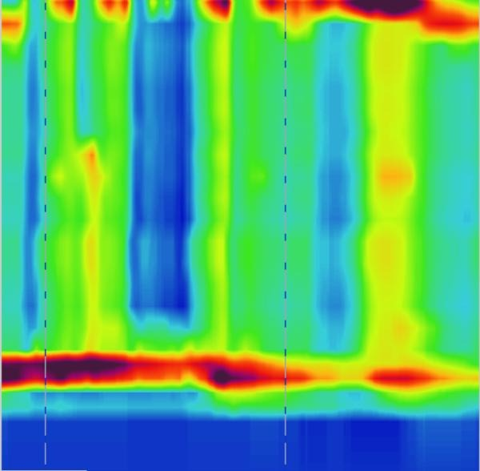
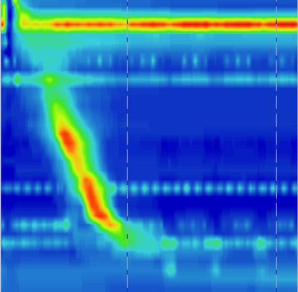
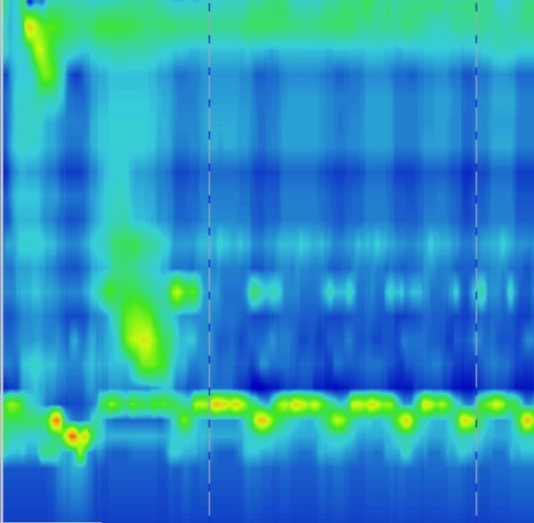
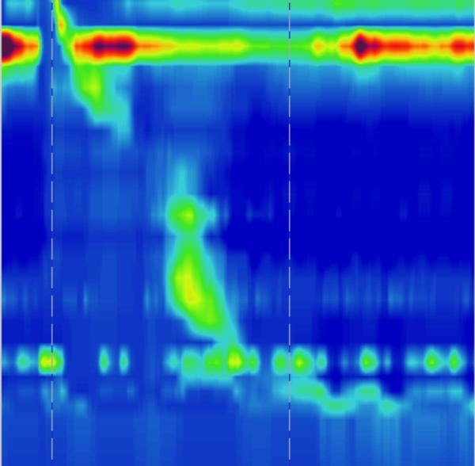
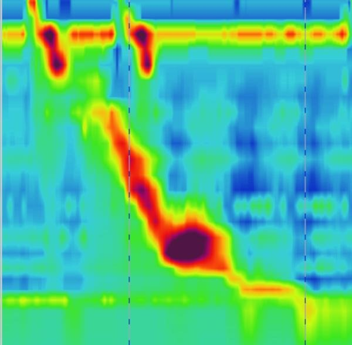
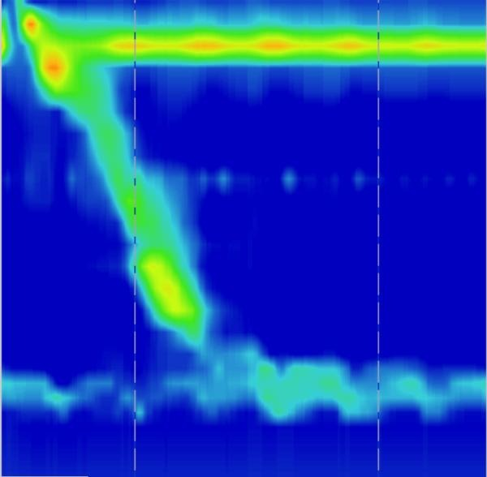

# Manometry Models

Repositório para classificação de imagens de manometria esofágica com PyTorch. O projeto inclui estrutura de dados já separada em `train/`, `val/` e `test/`, pipeline de treino e avaliação, suporte a múltiplos backbones, exportação de métricas e um script de inferência para imagem única.

## O Que Existe Neste Repositório

- dataset de imagens organizado por classe;
- baseline com uma CNN própria;
- suporte a backbones do `torchvision` para transferência de aprendizado;
- filtro automático dos arquivos de aumento offline misturados em `data/train`;
- treino com pesos por classe para reduzir o impacto do desbalanceamento;
- geração de checkpoint, histórico de treino, métricas de teste e gráficos em SVG;
- inferência a partir de um checkpoint salvo.

## Estrutura

```text
.
├── data/
│   ├── train/
│   ├── val/
│   └── test/
├── artifacts/
├── manometry_models/
├── train_cnn.py
├── predict_cnn.py
├── prepare_dataset.py
├── generate_plots.py
└── requirements.txt
```

As classes esperadas pelo pipeline são:

1. `Bradycardia_type_II`
2. `DES`
3. `EGJ`
4. `IEM`
5. `Jackhammer`
6. `normal`

O carregamento usa a convenção padrão de classificação por pastas, por exemplo:

```text
data/
  train/
    Bradycardia_type_II/
    DES/
    EGJ/
    IEM/
    Jackhammer/
    normal/
  val/
  test/
```

## Classes Clínicas do Dataset

As descrições abaixo são resumos voltados para o contexto de manometria esofágica de alta resolução (HRM). Elas servem para documentar os rótulos do dataset e não substituem interpretação clínica ou laudo especializado. As imagens mostradas são exemplos representativos copiados do conjunto `data/test` para `assets/readme_examples/`.

<table>
  <tr>
    <td valign="top"><strong><code>Bradycardia_type_II</code></strong><br>O dataset usa esse nome, mas no contexto de HRM ele é mais compatível com um padrão de <strong>acalasia tipo II</strong>: relaxamento inadequado da junção esofagogástrica com ausência de peristalse efetiva e pressurização panesofágica em parte das deglutições.</td>
    <td></td>
  </tr>
  <tr>
    <td valign="top"><strong><code>DES</code></strong><br><strong>Distal Esophageal Spasm</strong>. Representa um padrão com contrações prematuras ou espásticas no esôfago distal, frequentemente associado a disfagia e dor torácica não cardíaca.</td>
    <td></td>
  </tr>
  <tr>
    <td valign="top"><strong><code>EGJ</code></strong><br><strong>Esophagogastric Junction Outflow Obstruction</strong>. Há dificuldade de passagem na junção entre esôfago e estômago, com relaxamento inadequado da região distal, mas sem necessariamente preencher todos os critérios de acalasia.</td>
    <td></td>
  </tr>
  <tr>
    <td valign="top"><strong><code>IEM</code></strong><br><strong>Ineffective Esophageal Motility</strong>. Predomina um padrão de deglutições fracas, falhas ou fragmentadas, geralmente associado a pior depuração do bolo alimentar ao longo do esôfago.</td>
    <td></td>
  </tr>
  <tr>
    <td valign="top"><strong><code>Jackhammer</code></strong><br><strong>Hypercontractile Esophagus</strong>. Representa contrações excessivamente vigorosas; no subtipo jackhammer elas tendem a ser muito intensas e prolongadas em comparação ao padrão normal.</td>
    <td></td>
  </tr>
  <tr>
    <td valign="top"><strong><code>normal</code></strong><br>Padrão fisiológico de referência, com peristalse organizada e relaxamento adequado da junção esofagogástrica durante a deglutição.</td>
    <td></td>
  </tr>
</table>

Referências clínicas resumidas:

- Chicago Classification v4.0: https://pmc.ncbi.nlm.nih.gov/articles/PMC8034247/
- Review clínica da CCv4.0: https://pmc.ncbi.nlm.nih.gov/articles/PMC9021169/

## Observações Sobre os Dados

O diretório `data/train` mistura imagens originais com arquivos de aumento offline já materializados, identificados por prefixos como:

- `rotateImage`
- `brightnessE`
- `addGaussianNoise`
- `addSaltAndPepperNoise`
- `resizeImage`
- `saturationE`
- `cesun`

Por padrão, esses arquivos são excluídos do treino. `val` e `test` são usados como estão.

Se quiser reproduzir exatamente o conteúdo bruto de `data/train`, rode o treino com `--include-offline-augmented`.

## Modelos Suportados

| Modelo | Tipo | Tamanho padrão |
| --- | --- | ---: |
| `cnn` | CNN própria | 224 |
| `wang_cvp_gat` | grafo de atenção inspirado no artigo do Wang | 224 |
| `resnet18` | backbone `torchvision` | 224 |
| `efficientnet_b0` | backbone `torchvision` | 224 |
| `convnext_tiny` | backbone `torchvision` | 224 |
| `densenet201` | backbone `torchvision` | 224 |
| `inception_v3` | backbone `torchvision` | 299 |

Observações:

- `cnn` não usa pesos pré-treinados.
- `wang_cvp_gat` usa um encoder convolucional baseado em `ResNet18` e depois constrói um grafo esparso sobre a imagem de HRM.
- Na configuração padrão, o modelo usa `6` nós verticais, aproximando as seis regiões de vigor discutidas no artigo, e combina correlação de representação com correlação posicional relativa.
- Os demais backbones podem usar `--pretrained`.
- Quando `--pretrained` é usado, a normalização muda para o padrão ImageNet.
- O `predict_cnn.py` recupera do checkpoint o backbone, o tamanho de imagem e a normalização usados no treino.

## Instalação

Use Python 3.10 ou superior.

```bash
python3 -m venv .venv
source .venv/bin/activate
pip install -r requirements.txt
```

## Treino

Treino padrão com a CNN própria:

```bash
python3 train_cnn.py
```

Esse comando:

- usa `data/` como origem;
- treina o modelo `cnn`;
- remove do treino os arquivos de aumento offline;
- grava os artefatos em `artifacts/cnn`.

Argumentos principais:

- `--model`
- `--pretrained`
- `--data-dir`
- `--output-dir`
- `--run-name`
- `--epochs`
- `--batch-size`
- `--image-size`
- `--learning-rate`
- `--weight-decay`
- `--dropout`
- `--graph-num-nodes`
- `--graph-temporal-bins`
- `--graph-hidden-dim`
- `--graph-num-heads`
- `--graph-num-layers`
- `--graph-radius`
- `--num-workers`
- `--augment`
- `--device auto|cpu|cuda|mps`
- `--no-class-weights`
- `--include-offline-augmented`

Exemplo com ajustes manuais:

```bash
python3 train_cnn.py \
  --model densenet201 \
  --pretrained \
  --epochs 30 \
  --batch-size 32 \
  --learning-rate 3e-4 \
  --augment \
  --output-dir artifacts/densenet201_run_01
```

## Como Rodar Cada Backbone

Se a ideia for testar todos os backbones suportados, estes são os comandos diretos.

### CNN própria

```bash
python3 train_cnn.py \
  --model cnn \
  --output-dir artifacts/cnn
```

### ResNet18

```bash
python3 train_cnn.py \
  --model resnet18 \
  --pretrained \
  --output-dir artifacts/resnet18_pretrained
```

### EfficientNet-B0

```bash
python3 train_cnn.py \
  --model efficientnet_b0 \
  --pretrained \
  --output-dir artifacts/efficientnet_b0_pretrained
```

### ConvNeXt Tiny

```bash
python3 train_cnn.py \
  --model convnext_tiny \
  --pretrained \
  --output-dir artifacts/convnext_tiny_pretrained
```

### DenseNet201

```bash
python3 train_cnn.py \
  --model densenet201 \
  --pretrained \
  --output-dir artifacts/densenet201_pretrained
```

### Inception v3

```bash
python3 train_cnn.py \
  --model inception_v3 \
  --pretrained \
  --output-dir artifacts/inception_v3_pretrained
```

### Wang CVP-GAT

```bash
python3 train_cnn.py \
  --model wang_cvp_gat \
  --pretrained \
  --graph-num-nodes 6 \
  --graph-temporal-bins 8 \
  --graph-hidden-dim 256 \
  --graph-num-heads 4 \
  --graph-num-layers 2 \
  --graph-radius 2 \
  --output-dir artifacts/wang_cvp_gat_pretrained
```

Como o `inception_v3` usa tamanho padrão `299`, não é necessário passar `--image-size` se você quiser o comportamento padrão do código.

Se quiser executar todos em sequência no shell:

```bash
python3 train_cnn.py --model cnn --output-dir artifacts/cnn
python3 train_cnn.py --model resnet18 --pretrained --output-dir artifacts/resnet18_pretrained
python3 train_cnn.py --model efficientnet_b0 --pretrained --output-dir artifacts/efficientnet_b0_pretrained
python3 train_cnn.py --model convnext_tiny --pretrained --output-dir artifacts/convnext_tiny_pretrained
python3 train_cnn.py --model densenet201 --pretrained --output-dir artifacts/densenet201_pretrained
python3 train_cnn.py --model inception_v3 --pretrained --output-dir artifacts/inception_v3_pretrained
```

## Preparar uma Cópia Limpa do Dataset

Se quiser gerar um novo diretório sem os aumentos offline do treino:

```bash
python3 prepare_dataset.py \
  --source-dir data \
  --output-dir data_clean
```

Por padrão, o script usa `hardlink`. Para copiar os arquivos fisicamente:

```bash
python3 prepare_dataset.py \
  --source-dir data \
  --output-dir data_clean \
  --mode copy
```

Depois disso, é possível treinar usando a cópia limpa:

```bash
python3 train_cnn.py --data-dir data_clean
```

## Saídas do Treino

Cada execução gera um diretório de artefatos com arquivos como:

- `best_model.pt`
- `history.csv`
- `test_metrics.json`
- `training_summary.json`
- `plots/loss.svg`
- `plots/accuracy.svg`
- `plots/confusion_matrix.svg`

O melhor checkpoint é escolhido com base em macro F1 na validação.

## Inferência

Para classificar uma única imagem a partir de um checkpoint:

```bash
python3 predict_cnn.py \
  --checkpoint artifacts/resnet18_pretrained/best_model.pt \
  --image data/test/EGJ/11.jpg
```

Saída em JSON:

```bash
python3 predict_cnn.py \
  --checkpoint artifacts/resnet18_pretrained/best_model.pt \
  --image data/test/EGJ/11.jpg \
  --json
```

## Gerar Gráficos Novamente

Se `history.csv` e `test_metrics.json` já existirem:

```bash
python3 generate_plots.py --artifacts-dir artifacts/cnn
```

## Arquivos Principais

- [train_cnn.py](/home/andre/repos/manometry_models/train_cnn.py): ponto de entrada de treino.
- [predict_cnn.py](/home/andre/repos/manometry_models/predict_cnn.py): inferência em imagem única.
- [prepare_dataset.py](/home/andre/repos/manometry_models/prepare_dataset.py): cria uma cópia limpa do dataset.
- [generate_plots.py](/home/andre/repos/manometry_models/generate_plots.py): regenera os gráficos de um diretório de artefatos.
- [manometry_models/model.py](/home/andre/repos/manometry_models/manometry_models/model.py): definição da CNN própria e criação dos backbones.
- [manometry_models/data.py](/home/andre/repos/manometry_models/manometry_models/data.py): transforms, dataloaders e pesos por classe.
- [manometry_models/model_registry.py](/home/andre/repos/manometry_models/manometry_models/model_registry.py): nomes suportados e tamanhos padrão.
- [manometry_models/training.py](/home/andre/repos/manometry_models/manometry_models/training.py): loop de treino, avaliação e checkpoint.
- [manometry_models/metrics.py](/home/andre/repos/manometry_models/manometry_models/metrics.py): métricas e matriz de confusão.
- [manometry_models/plots.py](/home/andre/repos/manometry_models/manometry_models/plots.py): geração dos gráficos.
